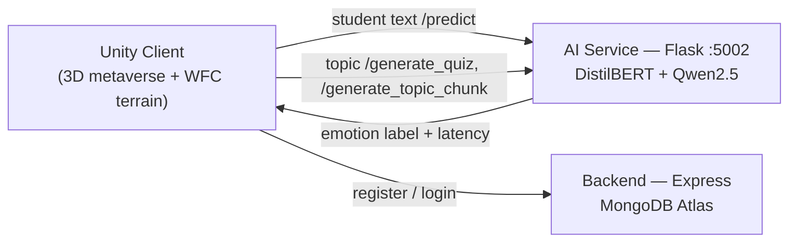

# MAGSEL — Metaverse for Gender-Sensitive Social-Emotional Learning

> **MAGSEL** (Metaverse for Gender-Sensitive Social-Emotional Learning) is a metaverse for gender-sensitive social-emotional education, where students learn inside a Unity 3D world that reads their emotional state in real time and adapts to it.


Solo research project, presented at the **WILLS 2025 Conference**, Kyoto University of Foreign Studies, Japan.

---

## Overview

MAGSEL combines an immersive 3D metaverse with on-device AI so that a learning environment can respond to *how a student feels*, not just what they click. Three pieces work together:

- a **Unity** client that generates its world procedurally and renders the metaverse,
- a **Python AI service** that classifies emotion and generates learning content, and
- a **Node backend** that handles accounts.

## Architecture



## Features

- **Procedural terrain via Wave Function Collapse.** A WFC solver written from scratch in C# builds the world's terrain from tile constraints, with a networked manager so the environment stays consistent across clients and a benchmark harness to measure generation time.
  `Frontend/Metaverse/Assets/Scripts/Terrain/` — `WaveFunctionCollapse.cs`, `Cell.cs`, `NetworkTerrainManager.cs`, `TerrainBenchmark.cs`
- **Real-time emotion detection.** A DistilBERT classifier fine-tuned on six emotions (sadness, joy, love, anger, fear, surprise) reads student text; Unity sends text to the API and adapts to the returned label.
  `Metaverse Files/appp.py` (`POST /predict`), `Frontend/Metaverse/Assets/Scripts/EmotionAnalyzer.cs`
- **On-device learning content generation.** A local Qwen2.5-0.5B-Instruct model generates quiz questionnaires and extracts topics/context chunks from free text, returned as strict JSON.
  `Metaverse Files/appp.py` (`POST /generate_quiz`, `POST /generate_topic_chunk`)
- **Accounts.** Registration and login over an Express + MongoDB backend.
  `Backend/src/Routes/UserRoutes.js`

## Repository structure

```
MAGSEL/
├── Backend/            Node/Express + MongoDB API (accounts)
│   ├── index.js
│   └── src/{Models,Routes}
├── Frontend/Metaverse/ Unity client
│   └── Assets/Scripts/{Terrain, EmotionAnalyzer.cs, ...}
└── Metaverse Files/    Python AI service + training
    ├── appp.py                 Flask API (:5002)
    ├── fine_tune_emotion.py    DistilBERT fine-tuning
    ├── accuracy_test.py        eval harness (accuracy/F1/latency/confusion)
    └── benchmark.py
```

## The emotion model

`fine_tune_emotion.py` fine-tunes `distilbert-base-uncased` on the Hugging Face `emotion` dataset augmented with a custom `additional_data.xlsx`, over the six classes above (2 epochs, lr 2e-5, batch 32, fp16). It reports weighted F1 and accuracy on the held-out test split, roughly **92% accuracy / 0.93 weighted F1**. `accuracy_test.py` re-checks the live API against a labeled set and also prints per-class precision/recall, a confusion matrix, and latency.

The `additional_data.xlsx` augmentation file is not included in this repo, so re-running `fine_tune_emotion.py` as-is trains on the Hugging Face `emotion` dataset alone; supply your own `additional_data.xlsx` (a `text`/`label` sheet) in `Metaverse Files/` to reproduce the augmented run.

## Getting started

### 1. Backend (accounts API)

```bash
cd Backend
npm install
# create Backend/.env with:
#   PORT=3000
#   DBUSER=<mongodb user>
#   DBPASS=<mongodb password>
npm start
```
Routes: `POST /user/register`, `POST /user/login`, `GET /` (health).

### 2. AI service (emotion + generation)

```bash
cd "Metaverse Files"
python -m venv venv && source venv/Scripts/activate   # Windows Git Bash
pip install flask transformers torch datasets scikit-learn pandas matplotlib seaborn openpyxl numpy
python appp.py          # serves on http://localhost:5002
```

Model weights are **not** committed (see Notes). Before running:
- produce the emotion model with `python fine_tune_emotion.py` (writes `distilbert-finetuned-emotion/`), and
- download `Qwen/Qwen2.5-0.5B-Instruct` into `Metaverse Files/Qwen2.5-0.5B-Instruct/`.

### 3. Unity client

Open `Frontend/Metaverse/` as a project in Unity. The client calls the AI service at `http://localhost:5002`, so start the AI service first.

## API reference

| Method | Endpoint | Body | Returns |
|---|---|---|---|
| POST | `/predict` | `{ "text": "..." }` | predicted emotion label, class index, latency |
| POST | `/generate_quiz` | `{ "topic", "chunk_text", "difficulty" }` | 3-question quiz as JSON |
| POST | `/generate_topic_chunk` | `{ "text": "..." }` | primary topic + key chunks as JSON |
| POST | `/user/register` | `{ "name", "email", "password" }` | created user |
| POST | `/user/login` | `{ "email", "password" }` | auth result |

## Tech stack

Unity, C#, Python, PyTorch, Hugging Face Transformers, DistilBERT, Qwen2.5-0.5B-Instruct, Flask, Node.js, Express, MongoDB.

## Notes

Large model weights, base models, Unity's generated folders, `venv`, `node_modules`, binary art assets, and `.env` are excluded via `.gitignore`. The fine-tuned emotion model is reproducible with `fine_tune_emotion.py`; the Qwen base model downloads from Hugging Face.

## Research

Presented at WILLS 2025, Kyoto University of Foreign Studies. The work explores whether a metaverse that is aware of a learner's emotional state can improve engagement in social-emotional education.

## License

Released under the MIT License — see [LICENSE](LICENSE). This covers the original MAGSEL code; bundled third-party Unity assets (FishNet, Kenney kits, TextMesh Pro, VRM/UniGLTF, StarterAssets) keep their own licenses under `Frontend/Metaverse/Assets/`.

## Author

Daniel Alexis Cruz — [github.com/Exalt24](https://github.com/Exalt24) · [dacruz.vercel.app](https://dacruz.vercel.app)
